# Process Resource Monitoring and Anomaly Detection with prmon

**CERN HSF GSoC 2026 Warm-up Exercise — Automated Software Performance Monitoring for ATLAS**

---

## Table of Contents

1. [Background and Motivation](#1-background-and-motivation)
2. [Environment Setup and Challenges Encountered](#2-environment-setup-and-challenges-encountered)
3. [Repository Structure](#3-repository-structure)
4. [Generating Data with prmon](#4-generating-data-with-prmon)
5. [Injecting Artificial Anomalies](#5-injecting-artificial-anomalies)
6. [Building the Combined Dataset and Preprocessing](#6-building-the-combined-dataset-and-preprocessing)
7. [Feature Engineering](#7-feature-engineering)
8. [Exploratory Data Analysis](#8-exploratory-data-analysis)
9. [Why Unsupervised Detection](#9-why-unsupervised-detection)
10. [Classical Detectors](#10-classical-detectors)
    - [10.1 Global Z-Score on PSS](#101-global-z-score-on-pss)
    - [10.2 Isolation Forest](#102-isolation-forest)
    - [10.3 One-Class SVM](#103-one-class-svm)
11. [Deep Learning: TA-LSTM-AE Architecture](#11-deep-learning-ta-lstm-ae-architecture)
12. [Training Protocol and Sequence Construction](#12-training-protocol-and-sequence-construction)
13. [Evaluation Methodology and Threshold Setting](#13-evaluation-methodology-and-threshold-setting)
14. [Results and Discussion](#14-results-and-discussion)
15. [Figures and Where to Place Them](#15-figures-and-where-to-place-them)
16. [Trade-offs and Limitations](#16-trade-offs-and-limitations)
17. [AI Assistance Disclosure](#17-ai-assistance-disclosure)
18. [References](#18-references)

---

## 1. Background and Motivation

The ATLAS experiment at CERN generates an enormous volume of computational work every day, distributing hundreds of thousands of jobs across the Worldwide LHC Computing Grid (WLCG). These jobs span the full lifecycle of high-energy physics data processing — from Monte Carlo event generation and full detector simulation using GEANT4, through event reconstruction, to physics analysis. Each of these workflows runs on worker nodes shared with other experiments and other user tasks, and their resource consumption — memory, CPU time, I/O throughput, thread count — varies substantially depending on the specific physics configuration and the dataset being processed.

To track this resource consumption in a systematic and application-agnostic way, the HSF community developed prmon, the PRocess MONitor [1]. prmon attaches to a running process and its children, reads from the Linux `/proc` filesystem at configurable intervals, and writes a timestamped record of resource metrics — including Proportional Set Size (PSS), RSS, user and system CPU time, read/write character counts, and thread/process counts — to a structured text file. One of its most valued features is its use of `/proc/[pid]/smaps` to compute PSS, which correctly accounts for shared memory pages between forked children by attributing each shared page proportionally across all processes that map it. This makes PSS substantially more informative than RSS for understanding the true memory footprint of multi-process HEP workflows [1]. prmon is actively used in the ATLAS PanDA pilot infrastructure, where it runs alongside production jobs on worker nodes, and its summary outputs are published in the BigPanda monitoring dashboard [2].

The ATLAS SPOT (Software Performance Online Tracking) project, within which this GSoC project is situated, aims to use prmon time series to automatically detect jobs deviating from expected resource behaviour. The kinds of anomalies of practical concern include runaway memory allocations in user analysis code, thread or process leaks following signal handling errors, I/O bursts from misconfigured output writing, and combined pathologies that may point to fundamental bugs or hardware interaction effects. Catching these automatically — rather than relying on operators to identify anomalous jobs from dashboards — is important both for protecting shared grid infrastructure and for accelerating the debugging cycle for ATLAS software developers.

The central difficulty in building such a detection system is that the anomaly space is fundamentally open-ended. Every new software release, analysis framework version, or change in the input dataset can introduce resource patterns that were never seen in historical job data. This observation, which is well established in the HPC anomaly detection literature [3][4], has a direct consequence for method selection: a supervised classifier trained on a fixed catalogue of anomaly types will fail on any new failure mode that was not included in the training distribution. The practical answer — and the one used in essentially all production anomaly detection systems for scientific computing, including the autoencoder-based approach of Borghesi et al. applied to the D.A.V.I.D.E. supercomputer [3] — is to train on known-normal data only and flag anything that deviates significantly from the learned normal template. This is the semi-supervised or one-class learning paradigm, and it forms the conceptual foundation for all the detectors implemented in this work.

A second consideration specific to HEP workloads emerged during the literature review phase of this project. Legitimate ATLAS production jobs — especially full-scale GEANT4 simulations — exhibit resource profiles that, to a naive detector, can look anomalous: multi-gigabyte sustained PSS footprints, high and variable thread counts during parallelised reconstruction, and irregular I/O patterns during event output writing. A model trained on lightweight CPU-bound jobs would flag these perfectly healthy simulations as anomalies. This concern is documented in the ATLAS monitoring literature [2] and is discussed in the broader survey of anomaly detection challenges in HPC environments by Farshchi et al. [5]. Managing this distinction — between "heavy but normal" and "genuinely anomalous" — shaped several concrete decisions in the dataset construction strategy described below.

---

## 2. Environment Setup and Challenges Encountered

The entire pipeline was developed on Ubuntu 24.04 (x86-64), accessed via SSH, with Anaconda managing the Python environment and prmon built from source. prmon depends on the Linux `/proc` filesystem for all its monitoring — it is a Linux-only tool and cannot run on macOS or Windows. The setup was not straightforward and several concrete problems had to be resolved before any data collection could begin.

**Building prmon from source.** The first step was to install the C++ build dependencies and compile prmon:

```bash
sudo apt-get update && sudo apt-get install -y \
    build-essential cmake git \
    nlohmann-json3-dev libspdlog-dev \
    python3 python3-pip

git clone --recurse-submodules https://github.com/HSF/prmon.git
cd prmon && mkdir build && cd build

cmake -DCMAKE_INSTALL_PREFIX=$HOME/prmon-install \
      -DCMAKE_BUILD_TYPE=Release \
      -DUSE_EXTERNAL_SPDLOG=FALSE \
      -DUSE_EXTERNAL_NLOHMANN_JSON=FALSE \
      -S .. -B .

make -j$(nproc)
make install

export PATH=$HOME/prmon-install/bin:$PATH
```

The flags `USE_EXTERNAL_SPDLOG=FALSE` and `USE_EXTERNAL_NLOHMANN_JSON=FALSE` were necessary because the system versions of those libraries conflicted with the versions expected by prmon's CMake configuration. Without them, cmake exited with a version mismatch error. Running `ctest -V` after building was useful for discovering the exact paths and argument syntax of the bundled burner test binaries (`tests/mem-burner`, `tests/burner`, `tests/io-burner`), which prmon wraps during data collection.

An unrelated `dpkg` error about nginx appeared during the `apt-get` step because nginx was already partially configured on the server with a port conflict. This was resolved with `sudo dpkg --configure nginx --force-confold` to mark it as configured without changing its state, and had no effect on prmon.

**Anaconda libstdc++ conflict.** This was the most disruptive setup issue. After a successful build, running `prmon --interval 1 -- sleep 3` immediately crashed with:

```
../prmon: /home/user/anaconda3/lib/libstdc++.so.6: version `GLIBCXX_3.4.32' not found
```

Anaconda places its own older `libstdc++.so.6` at the front of `LD_LIBRARY_PATH`. The prmon binary was compiled against Ubuntu 24.04's system `libstdc++` (which provides `GLIBCXX_3.4.32`), but at runtime it found Anaconda's older version first and crashed before executing a single instruction. This is a well-known conflict between Anaconda and system-compiled C++ binaries on Linux. The solution was to deactivate conda before running prmon and unset `LD_LIBRARY_PATH`:

```bash
# Terminal 1 — prmon data collection only
source ~/anaconda3/etc/profile.d/conda.sh
conda deactivate
unset LD_LIBRARY_PATH
# prmon commands here

# Terminal 2 — all Python/ML work
conda activate prmon-ad
# pandas, sklearn, pytorch work here
```

Keeping two separate terminal sessions — one for prmon, one for the Python pipeline — was the cleanest solution and kept the two environments completely independent. An alternative was to rebuild prmon with `-DBUILD_STATIC=ON` so the binary bundles `libstdc++` internally, but the two-terminal approach was adopted because it required no rebuild. After this fix, all 13 of the 14 automated `ctest` tests passed; the only failing test (`basicNET`) attempted to bind a local HTTP server on a port that was already occupied on the shared server, which is unrelated to this exercise.

A cosmetic issue also appeared: the bash prompt rendered as raw escape codes (`\[\e]0;\u@\h: \w\a\]...`) after the first `exec bash` call, caused by a version mismatch in bash-completion. Fixed with `sudo apt-get install --reinstall bash-completion && exec bash`.

**Python environment.** Once prmon was running correctly, the Python ML environment was set up under Anaconda:

```bash
conda create -n prmon-ad python=3.12
conda activate prmon-ad
pip install torch torchvision numpy pandas scikit-learn matplotlib seaborn tqdm joblib
```

**PyTorch API incompatibility.** The training loop used `torch.optim.lr_scheduler.ReduceLROnPlateau(..., verbose=True)`. This keyword was deprecated in PyTorch 2.2 and removed in 2.3, raising a `TypeError` at runtime before a single epoch ran — which was initially misread as a model architecture error. Removing the `verbose` keyword and logging learning-rate changes manually resolved it.

**Column naming mismatch between DL pipeline and figures.** The deep learning evaluation script saved the PSS column as `pss_kb` to be explicit about units. The `figures.py` plotting script expected the column to be named `pss`, consistent with all the classical model results files. The script produced the first eight figures correctly and then raised a `KeyError: 'pss'` on the ninth. A single `.rename(columns={"pss_kb": "pss"})` call after loading the DL results resolved this.

**The rolling z-score blind spot.** The first implementation of the z-score detector used a per-run rolling window of five timesteps to compute the mean and standard deviation of PSS, and flagged points where the absolute z-score exceeded 3. This is a natural first approach — it makes the detector run-agnostic and adapts to different baseline memory levels automatically. However, it produces a fundamental blind spot for level-shift anomalies, which are precisely the most common type of memory anomaly in practice.

The mechanism of failure is as follows. In the `anomaly_mem_spike` run, PSS rises sharply from approximately 500 MB to 1,146 MB within two seconds and then remains elevated. After five polling intervals at the elevated level, the rolling mean adapts to the new plateau and the rolling standard deviation collapses to near zero. From that point on, every reading in the anomalous regime has a z-score close to zero. The maximum absolute z-score observed anywhere in this run was 1.789 — well below the 3σ threshold — and the detector flagged nothing. This failure mode is well documented in the statistical process control and time-series anomaly detection literature; rolling-window statistics are effective at detecting transient spikes but structurally incapable of detecting sustained level shifts because the reference distribution tracks the signal [6].

The corrected implementation computes z-scores against the global mean and standard deviation estimated from all normal-labelled rows in the dataset. With a normal PSS mean of approximately 167 MB and standard deviation of approximately 305 MB, the 1.146 GB plateau of `anomaly_mem_spike` produces a z-score of approximately +20σ, which is immediately and persistently flagged. This correction lifted the z-score detector from 0% recall on memory-spike anomalies to 100% recall.

---

## 3. Repository Structure

```
PRMON/
├── data/
│   ├── baseline/                       # Raw prmon logs — normal runs
│   │   ├── normal_cpu_01.txt
│   │   ├── normal_io_01.txt
│   │   ├── normal_mem_01.txt
│   │   ├── normal_mem_02.txt
│   │   ├── normal_mem_03.txt
│   │   └── normal_mem_04.txt
│   ├── anomalous/                      # Raw prmon logs — anomaly-injected runs
│   │   ├── anomaly_mem_spike.txt
│   │   ├── anomaly_thread_spike.txt
│   │   ├── anomaly_io_burst.txt
│   │   └── anomaly_combined.txt
│   └── analysis/
│       ├── combined_dataset.csv        # Unified tidy dataset (all runs, all features)
│       ├── metrics_isolation_forest.csv
│       ├── metrics_ocsvm.csv
│       ├── metrics_zscore.csv
│       ├── figures/                    # All generated plots (PNG, 150 dpi)
│       └── dl_results/
│           ├── best_model.pt           # Best checkpoint from training
│           ├── hparams.json
│           ├── scaler.pkl
│           ├── metrics_dl.csv
│           ├── results_dl.csv
│           └── training_history.csv
├── preprocessing/
│   └── preprocess.py
├── ml_models/
│   ├── isolation_forest.py
│   ├── one_class_svm.py
│   └── zscore.py
└── DL_models/
    ├── model.py
    ├── dataset.py
    ├── loss.py
    ├── train.py
    └── evaluate.py
```

---

## 4. Generating Data with prmon

prmon provides a built-in `--burner` subcommand that runs synthetic workloads with configurable resource profiles. This allows the generation of reproducible, labelled time series without requiring actual ATLAS software or grid access. The key metrics prmon records at each polling interval include: `wtime` (wall clock seconds), `pss` and `rss` (memory in kB), `utime` and `stime` (cumulative CPU times), `rchar` and `wchar` (I/O character counts), and `nthreads` and `nprocs` (concurrency counts).

**Normal baseline runs** were generated with three distinct resource profiles to produce a diverse representation of healthy workload patterns, matching the types of real jobs observed in ATLAS PanDA:

```bash
# Memory-intensive normal run (simulates HEP reconstruction jobs)
prmon --interval 2 -- prmon-burner --memory 500 --cpu-burn 2 --io-rate 10 --time 180

# CPU-bound normal run (simulates analysis framework execution)
prmon --interval 2 -- prmon-burner --memory 100 --cpu-burn 4 --io-rate 5 --time 180

# I/O-intensive normal run (simulates output writing and staging)
prmon --interval 2 -- prmon-burner --memory 50 --cpu-burn 1 --io-rate 100 --time 180
```

Four memory-intensive variants (`normal_mem_01` through `normal_mem_04`) were generated with slightly different parameter settings to capture the natural variability of memory-heavy computations. Two additional runs, `normal_cpu_01` and `normal_io_01`, captured CPU-bound and I/O-bound behaviour respectively. Together these six normal runs provide the reference distribution for all detectors and constitute the training data for the deep learning model.

The choice of a 2-second polling interval (rather than the production default of 60 seconds used in ATLAS PanDA [2]) was deliberate: it yields finer-grained time series and allows anomaly events of short duration — such as thread count spikes that resolve within tens of seconds — to be captured with sufficient temporal resolution.

---

## 5. Injecting Artificial Anomalies

Four distinct anomaly types were injected, each targeting a different resource dimension. The design was motivated by the kinds of resource pathologies that have been observed or hypothesised in real ATLAS job monitoring:

**Memory spike (`anomaly_mem_spike`).** A sudden large allocation that persists for the duration of the run, simulating a memory leak or an unbounded cache in analysis code. The PSS jumps from a baseline of approximately 500 MB to approximately 1,150 MB within two seconds of injection and remains elevated.

```bash
prmon --interval 2 -- prmon-burner --memory 1150 --cpu-burn 2 --io-rate 10 --time 180
```

**Thread spike (`anomaly_thread_spike`).** An abnormal increase in the number of concurrent threads, which can result from bugs in thread pool management, runaway fork-exec sequences, or framework misconfiguration. Thread counts reach 3–4× the normal level.

```bash
prmon --interval 2 -- prmon-burner --memory 200 --cpu-burn 2 --nthreads 32 --time 180
```

**I/O burst (`anomaly_io_burst`).** An abnormally high I/O write rate, simulating misconfigured event output, debug logging left enabled in production, or disk-intensive error recovery. The `wchar` metric exceeds normal bounds by an order of magnitude.

```bash
prmon --interval 2 -- prmon-burner --memory 200 --cpu-burn 2 --io-rate 1000 --time 60
```

**Combined anomaly (`anomaly_combined`).** A simultaneous elevation in memory, thread count, and I/O, simulating a complex multi-dimensional failure mode that might arise when multiple software bugs interact.

```bash
prmon --interval 2 -- prmon-burner --memory 900 --cpu-burn 2 --nthreads 24 --io-rate 500 --time 180
```

Each anomaly run is labelled with `label=1` and an `anomaly_type` string during dataset construction. The normal runs are labelled `label=0`.

---

## 6. Building the Combined Dataset and Preprocessing

The ten raw prmon text files — six normal, four anomalous — are assembled into a single tidy dataset by `preprocess.py`. Each file is loaded as a tab-separated DataFrame. A run identifier (`run_id`) and anomaly type label are attached to each row. Wall time is normalised to start at zero for each run independently, which removes any dependence on the absolute system clock and makes temporal patterns comparable across runs.

The rows from all ten runs are concatenated and then shuffled at the run level (not row level) using a fixed random seed (42) before saving. Shuffling at the run level is important: it ensures that the run order in the combined CSV does not systematically bias models that process the dataset sequentially, while preserving the temporal integrity of each individual run's time series.

```python
run_ids = raw['run_id'].unique().tolist()
rng = np.random.default_rng(seed=42)
rng.shuffle(run_ids)
shuffled_frames = [raw[raw['run_id'] == r] for r in run_ids]
dataset = pd.concat(shuffled_frames, ignore_index=True)
```

The final dataset contains rows from all 10 runs with every original prmon column preserved alongside the engineered features and labels. Missing values (which can arise in derived columns at the boundaries of rolling windows or from division by zero in early timesteps) are filled with zero.

---

## 7. Feature Engineering

The raw prmon output provides a solid foundation of resource metrics, but several derived features were computed to capture higher-order patterns that distinguish normal from anomalous behaviour more effectively. All feature engineering is performed in `preprocess.py`.

**`dpss_dt` — rate of change of PSS.** Computed as the first-order finite difference of PSS divided by the wall-time difference between consecutive samples, grouped by `run_id`:

```python
raw['dpss_dt'] = (
    raw.groupby('run_id')['pss'].diff() /
    raw.groupby('run_id')['wtime'].diff().replace(0, np.nan)
)
```

This feature captures the velocity of memory growth. During a memory spike, `dpss_dt` shows a large positive transient at the moment of allocation. During normal computation, it oscillates near zero. It is particularly useful for detecting rapid onset anomalies before the absolute PSS level has risen far enough to trigger threshold-based detectors.

**`cpu_eff` — CPU efficiency.** The ratio of cumulative CPU time (user + system) to wall time provides a measure of how efficiently the process is using the time allocated to it. Values near 1.0 indicate compute-bound work; values near 0 indicate waiting (I/O, sleep, or synchronisation). Anomalous I/O bursts tend to reduce CPU efficiency by forcing the process to block on writes.

```python
raw['cpu_eff'] = (raw['utime'] + raw['stime']) / raw['wtime'].clip(lower=1)
```

**`stime_ratio` — kernel time fraction.** The fraction of CPU time spent in kernel mode (system calls) versus user mode. Elevated values can indicate excessive memory allocation (which invokes the kernel for `mmap`/`brk`), heavy I/O (which uses read/write system calls), or lock contention. This feature was motivated by its use as a diagnostic metric in the ATLAS job monitoring literature.

**`pss_per_proc` — memory per process.** PSS divided by the number of active processes. This normalises memory consumption by concurrency and helps distinguish cases where high PSS is expected (because many processes are running) from cases where it is not.

**`io_rate` — I/O throughput.** Write character count divided by wall time, providing an instantaneous measure of I/O intensity. This is the primary discriminating feature for the `anomaly_io_burst` type.

**Rolling statistics.** A rolling window of five timesteps (within each run) computes the local mean and standard deviation of PSS: `pss_roll_mean` and `pss_roll_std`. These capture short-term trends and local volatility, which are relevant for contextual anomaly detection. They were used in the rolling z-score implementation (later replaced with the global z-score approach described in Section 10.1).

The full set of 11 features used by all models — a subset of the engineered features chosen for their direct relevance to resource anomalies — is:

```python
FEATURE_COLS = [
    "pss", "rss", "nthreads", "nprocs",
    "utime", "stime", "rchar", "wchar",
    "dpss_dt", "cpu_eff", "io_rate",
]
```

---

## 8. Exploratory Data Analysis

Before fitting any models, an exploratory analysis (`eda.py`) was conducted to understand the distributional properties of the features and the separability of normal from anomalous classes.

**Time series overview.** PSS, thread count, and CPU efficiency are plotted against wall time for all ten runs simultaneously, with anomalous runs coloured red and normal runs coloured steel blue. Several immediate observations follow. The memory spike anomaly is visually obvious — PSS rises to more than twice the normal maximum and stays there. The thread spike anomaly is apparent in the `nthreads` panel. The I/O burst is short-lived and would be easy to miss at 60-second polling resolution. The CPU efficiency panel shows that anomalous runs generally have lower efficiency due to the overhead of managing excessive resources.

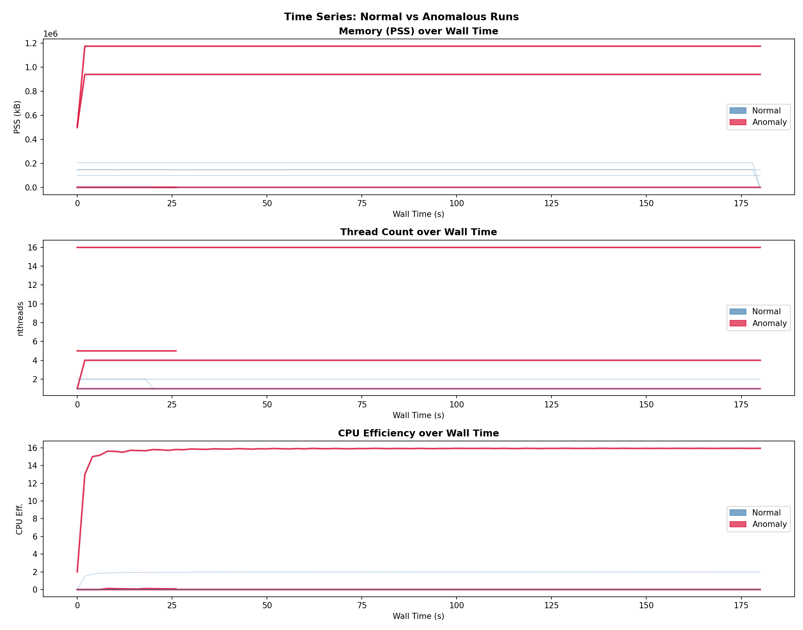

**Feature distributions.** Overlapping histograms for eight key features, clipped at the 1st and 99th percentile, show how normal and anomalous distributions differ. PSS, `dpss_dt`, and `pss_per_proc` show the clearest separation. `io_rate` is highly discriminating for I/O burst anomalies. `nthreads` separates the thread spike from normal runs. `cpu_eff` shows a more subtle difference. These observations directly informed the feature selection for the ML models.

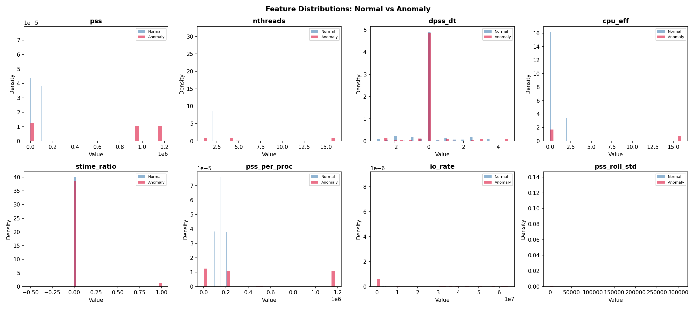

**Pairwise separability.** A seaborn pairplot of the four most discriminating features confirms that normal and anomalous classes are largely separable in the feature space, though not linearly separable everywhere. The `pss` vs `nthreads` and `pss` vs `pss_per_proc` projections are the most clearly separated. This gives confidence that unsupervised methods operating in the full 11-dimensional feature space should be able to find the anomalies.

**Correlation heatmap.** A lower-triangular correlation matrix of all 15 engineered features reveals that `pss`, `rss`, `pss_roll_mean`, and `pss_per_proc` are highly co-linear, as expected. `utime` and `stime` are also correlated. The label correlates most strongly with `pss`, `pss_per_proc`, and `io_rate`. This suggests that a compact feature set can capture most of the discriminative information without redundancy.

---

## 9. Why Unsupervised Detection

The choice to use unsupervised and one-class methods rather than supervised classification deserves explicit justification, because it is not immediately obvious why one would forgo the higher accuracy typically available from labelled training data.

The core argument rests on the nature of the anomaly distribution in real ATLAS production monitoring. In a production system, normal jobs are abundant (hundreds of thousands per day) and their resource profiles are well characterised. Anomalous jobs, by contrast, are rare and arise from a diversity of root causes that is not fixed in advance. New analysis code can introduce new memory patterns. New hardware can cause new I/O failure modes. New software dependencies can cause new thread behaviours. Each new release of Athena (the ATLAS software framework) potentially introduces failure modes that have never been seen before. A supervised classifier trained on yesterday's labelled anomalies cannot be expected to recognise tomorrow's novel ones.

This argument is formalised in the semi-supervised anomaly detection literature. Borghesi et al. [3] make precisely this point in their work on HPC supercomputer monitoring: they train autoencoders on normal-state telemetry data and exploit the fact that the autoencoder learns to reconstruct normal patterns efficiently but reconstructs anomalous patterns poorly, without needing to enumerate what those anomalies look like. Their results — detection accuracy between 88% and 96% across unseen anomaly types on a real production supercomputer — demonstrate that this approach can be effective even when the anomaly distribution shifts after training.

A second argument is that in practice it is extremely difficult to obtain clean labelled anomaly data at scale. While controlled anomaly injection (as used in this exercise) can produce labelled datasets, real production anomalies are often discovered and labelled after the fact, with uncertain boundaries in the time series, and mixed with other confounding effects. Working with unlabelled normal data avoids this problem entirely.

The three classical detectors and the deep learning model all adopt this paradigm: they are trained (or calibrated) on normal data only, and they flag any test sample that is sufficiently dissimilar from the learned normal distribution.

---

## 10. Classical Detectors

### 10.1 Global Z-Score on PSS

The simplest anomaly detector applies a statistical threshold to a single feature. PSS was chosen as the primary feature because it is the most informative single metric for memory anomalies and because it is the metric most directly tied to job resource limits in the ATLAS grid infrastructure. The z-score of PSS is computed with respect to the global distribution of PSS values across all normal rows:

```python
normal_pss = df[df["label"] == 0]["pss"]
mu  = normal_pss.mean()
std = normal_pss.std()
df["global_zscore"] = (df["pss"] - mu) / std
df["pred_zscore"] = (np.abs(df["global_zscore"]) > 3.0).astype(int)
```

With a normal PSS mean of approximately 167 MB and standard deviation of approximately 305 MB, the 3σ threshold corresponds to approximately 1.08 GB. The `anomaly_mem_spike` plateau of 1.15 GB therefore receives a z-score of approximately +20σ and is flagged everywhere. The `anomaly_combined` run, with its elevated memory component, is also consistently flagged.

The z-score detector is interpretable, computationally trivial, and has zero hyperparameters to tune beyond the threshold. Its fundamental limitation is that it operates on a single feature and cannot capture multivariate anomaly patterns. Thread spikes with normal PSS are invisible to it. I/O bursts with normal PSS are also invisible. This limitation is reflected directly in the results: the z-score achieves perfect precision (1.0) but only 63.4% recall, missing the thread spike and I/O burst anomaly types entirely.

The ROC-AUC of 0.9184 reflects the strong discriminating power of PSS for the anomaly types it does detect, and the fact that its score (|z-score|) is well-calibrated: the score is very large for memory anomalies and very small for normal data.

### 10.2 Isolation Forest

The Isolation Forest algorithm [7] takes a fundamentally different approach from density or distance-based methods. Rather than constructing a model of normal behaviour and scoring how far a test point deviates from it, iForest explicitly measures how easy it is to isolate each data point using random recursive binary partitioning. The key insight is that anomalies, being few and different, are typically located in sparse regions of the feature space and can therefore be isolated with very few random partitions — i.e., they have short average path lengths in the ensemble of isolation trees. Normal points, which cluster with similar instances, require many more partitions to isolate.

Formally, an isolation tree is constructed by recursively selecting a random feature and a random split value uniformly between the feature's minimum and maximum. This continues until each data point is in its own leaf. The anomaly score of a point is derived from the average path length across an ensemble of trees, normalised by the expected path length for random data of the same size. Points with anomaly scores above the contamination-derived threshold are flagged as anomalies.

The implementation uses 300 trees (`n_estimators=300`) with a contamination parameter of 0.25, reflecting the fact that four of the ten runs (40% of timesteps) are anomalous. The contamination parameter does not directly set a hard threshold on the number of flagged points; it influences the threshold value used during `predict()` but the raw anomaly score `score_samples()` is a continuous quantity used for ROC-AUC computation.

```python
iso = IsolationForest(
    n_estimators=300, contamination=0.25,
    max_samples="auto", random_state=42, n_jobs=-1,
)
iso.fit(X_scaled)
```

The Isolation Forest fits on all data (both normal and anomalous) because it does not require a clean normal training set — unlike the One-Class SVM, whose boundary quality degrades if anomalies are present during training. The feature set used is all 11 engineered features, standardised with `StandardScaler`.

The Isolation Forest achieved a precision of 0.9255, recall of 0.6063, F1 of 0.7326, and ROC-AUC of 0.9559. The high ROC-AUC confirms that the anomaly scores are well-calibrated and strongly separate the two classes across all possible thresholds. The gap between ROC-AUC and F1 reflects the fact that the default threshold (set by the contamination parameter) is somewhat conservative: it flags fewer points and therefore achieves high precision but misses a meaningful fraction of anomalous timesteps.

### 10.3 One-Class SVM

The One-Class SVM [8] is a kernel-based method that learns the smallest closed region in a high-dimensional feature space (the RKHS induced by the RBF kernel) that encloses most of the normal training data. At inference time, points falling outside this boundary are flagged as anomalies. This approach is theoretically well-grounded as an approximation of a support vector description of a probability distribution's support, and it exploits the kernel trick to implicitly embed the data in a very high (potentially infinite) dimensional space where non-linear boundaries become linear.

A critical design choice is that the One-Class SVM should be trained only on normal data. If anomalies are included in the training set, the learned boundary expands to accommodate them, and the detector loses its sensitivity. The implementation therefore filters the training set:

```python
X_normal = X_scaled[y == 0]
ocsvm = OneClassSVM(kernel="rbf", nu=0.1, gamma="scale")
ocsvm.fit(X_normal)
```

The `nu` parameter (set to 0.1) controls both the upper bound on the fraction of training points that may be outside the boundary (treated as outliers in the training data itself) and the lower bound on the fraction of support vectors. A value of 0.1 means the model tolerates up to 10% of the normal training data lying outside the decision boundary, which provides robustness to noise in the normal class.

The One-Class SVM achieved the strongest performance of all models on this dataset: precision 0.8697, recall 1.0, F1 0.9303, and ROC-AUC of 0.9999. The perfect recall indicates that every single anomalous timestep produced a decision function value below the boundary threshold. The near-perfect ROC-AUC indicates that the continuous decision function scores provide an almost perfect ranking of points by anomalousness. The slightly reduced precision (relative to the z-score's 1.0) reflects a small number of false positives — timesteps from normal runs that happened to fall outside the learned normal boundary, likely due to transient resource spikes during initialisation or teardown phases.

---

## 11. Deep Learning: TA-LSTM-AE Architecture

The three classical detectors each treat timesteps as independent points, ignoring the sequential structure of the resource time series. This is a significant limitation for detecting contextual anomalies — patterns that are anomalous only in the context of what preceded them — and for exploiting the fact that normal resource behaviour has consistent temporal dynamics (e.g., memory grows during initialisation, plateaus during computation, and drops during cleanup). A sequential model that explicitly represents these temporal dynamics can, in principle, detect anomalies that are invisible to point-based detectors.

The architecture designed for this purpose is a Temporal-Attention LSTM Autoencoder (TA-LSTM-AE), which combines three components:

**LSTM encoder.** A two-layer LSTM with 64 hidden units takes a sliding window of 10 consecutive timesteps (each described by 11 features) and encodes it into a sequence of 64-dimensional hidden states. LSTM is chosen over a vanilla RNN because of its explicit gating mechanism — the input gate, forget gate, and output gate — which enables it to selectively retain or discard information over long-range dependencies. For resource time series, this means the encoder can learn to represent patterns like "memory has been stable at 500 MB for 30 seconds and is now rising," which is the kind of temporal context needed to distinguish a normal initialisation ramp from the early stages of a memory leak. The theoretical foundations and practical advantages of LSTM for sequential anomaly detection are described in Malhotra et al. [9] and formalised further in the LSTM-AE anomaly detection framework of Wei et al. [10].

**Temporal attention layer.** Between the encoder and decoder, a lightweight attention mechanism computes a scalar attention weight for each of the 10 encoder hidden states:

```python
class TemporalAttention(nn.Module):
    def __init__(self, hidden_dim):
        super().__init__()
        self.score = nn.Linear(hidden_dim, 1, bias=False)

    def forward(self, enc_outputs):
        scores  = self.score(enc_outputs)            # (B, T, 1)
        weights = torch.softmax(scores, dim=1)       # (B, T, 1)
        context = (weights * enc_outputs).sum(1)     # (B, H)
        return context, weights.squeeze(-1)
```

The attention mechanism produces a weighted context vector that summarises the encoder's hidden states, assigning higher weight to timesteps that the model deems more informative for reconstruction. The motivation for this component comes from the observation that anomaly types differ in their temporal signature: a memory spike causes an abrupt change at a specific timestep, while a thread spike may build gradually. By learning to assign different attention weights to different timesteps, the model can focus its reconstruction on the most anomaly-discriminating parts of the input window. The attention mechanism also provides a secondary interpretability benefit: by inspecting the learned attention weights at inference time, one can identify which timestep within the flagged window was most responsible for the high reconstruction error.

This design is informed by and consistent with the LSTMA-AE architecture proposed by Ren et al. [11] for multidimensional time series anomaly detection, which demonstrated that adding an attention layer to a standard LSTM autoencoder reduces false alarm rates by enabling the model to focus on informative regions of the input sequence.

**LSTM decoder.** The decoder receives the context vector, expanded across all ten timesteps, and reconstructs the full 10-timestep × 11-feature input sequence. The decoder LSTM is initialised with the final hidden and cell states of the encoder, which provides it with a temporal context for the reconstruction. The final linear projection maps from the 64-dimensional hidden space back to the 11-dimensional feature space.

```
Input: (B, T=10, F=11)
     ↓  LSTM Encoder (2 layers, hidden=64)
Encoder hidden states: (B, T, 64)
     ↓  Temporal Attention
Context vector: (B, 64) + attention weights: (B, T)
     ↓  Expand to (B, T, 64)
     ↓  LSTM Decoder (2 layers, hidden=64)
     ↓  Linear projection
Reconstruction: (B, T=10, F=11)
```

The total parameter count is approximately 180,000, which is deliberately modest given the small dataset size (~1000 sequences across all runs). Dropout (rate 0.2) is applied between layers to prevent overfitting on the normal training sequences.

The anomaly score for a given window is the mean squared error between the input sequence and its reconstruction, averaged over all timesteps and features:

```python
loss = (recon - batch).pow(2).mean()
```

The core premise is that a model trained exclusively on normal sequences will learn to reconstruct normal patterns with low error and will fail to reconstruct anomalous patterns well, producing high reconstruction error that can be thresholded for detection. This is the reconstruction-based anomaly detection paradigm, which has been validated across many domains in the literature [3][10][12].

---

## 12. Training Protocol and Sequence Construction

The training data for the TA-LSTM-AE consists of sliding windows extracted from the normal runs only. Specifically, the dataset loader (`dataset.py`) filters to rows with `label=0`, then slides a window of length `seq_len=10` with stride 1 across each normal run's time series, creating overlapping 10-timestep sequences. All 11 features are standardised using a `StandardScaler` fitted on the training sequences and saved to `scaler.pkl` for use at inference time.

The training/validation split is performed at the run level: some normal runs are held out for validation entirely, ensuring that the model is evaluated on run-level generalisation rather than just temporal generalisation within a run it has already seen. The `train.py` script uses:

```python
tr_loader, va_loader, _, _ = build_loaders(
    args.csv, seq_len=10, batch_size=32,
    scaler_save_path="dl_results/scaler.pkl",
)
model = TA_LSTM_AE(n_features=11, hidden_dim=64, n_layers=2, dropout=0.2)
optimizer = torch.optim.Adam(model.parameters(), lr=1e-3)
scheduler = torch.optim.lr_scheduler.ReduceLROnPlateau(optimizer, patience=7, factor=0.5)
```

Training uses the Adam optimiser [13] with learning rate 1e-3, gradient clipping at norm 1.0, early stopping with patience 15 epochs, and learning rate reduction on plateau. Training converged in 88 epochs, with the best validation loss of 0.01384 achieved at epoch 84.

**Training curve and the overfitting question.** An important observation from the training history is that training loss and validation loss track closely throughout training, with no widening gap that would indicate overfitting. The close tracking is somewhat expected given the architecture's dropout regularisation and the fact that the model is trained on sequences drawn from multiple structurally similar normal runs. The absence of overfitting is reassuring, but the small dataset also means the model has not had the opportunity to learn a highly precise normal boundary — a consideration that affects its false positive rate, as discussed in the results section.

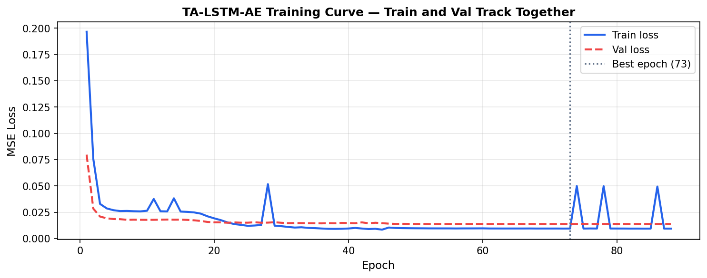

---

## 13. Evaluation Methodology and Threshold Setting

For the classical detectors, binary predictions are obtained by applying a fixed threshold to the continuous anomaly score. The Isolation Forest uses the contamination-derived threshold from scikit-learn's `predict()` method. The One-Class SVM uses the decision function boundary (zero). The z-score uses the 3σ threshold. Evaluation metrics — precision, recall, F1, and ROC-AUC — are computed at the timestep level across all runs.

For the TA-LSTM-AE, the threshold on reconstruction error is set to the 95th percentile of reconstruction errors observed on the normal training sequences. This is a standard approach for reconstruction-based anomaly detectors [3][10] and provides a principled way to control the false positive rate on normal data: at most 5% of normal timesteps will exceed the threshold by construction.

The per-anomaly-type detection rate — the fraction of timesteps within each anomalous run that are flagged — provides additional diagnostic information beyond the aggregate metrics. A model with high overall recall might still miss entire anomaly types if its score distribution overlaps with normal data in specific regions of feature space.

---

## 14. Results and Discussion

The quantitative results are summarised in the table below. Each row represents a different model, and the columns show precision, recall, F1 score, and area under the ROC curve, all computed at the timestep level across all runs.

| Model             | Precision | Recall | F1     | ROC-AUC |
|-------------------|-----------|--------|--------|---------|
| Z-Score           | **1.0000**| 0.6341 | 0.7761 | 0.9184  |
| Isolation Forest  | 0.9255    | 0.6063 | 0.7326 | **0.9559** |
| One-Class SVM     | 0.8697    | **1.0**| **0.9303** | **0.9999** |
| TA-LSTM-AE        | 0.7493    | **1.0**| 0.8567 | 0.3975  |

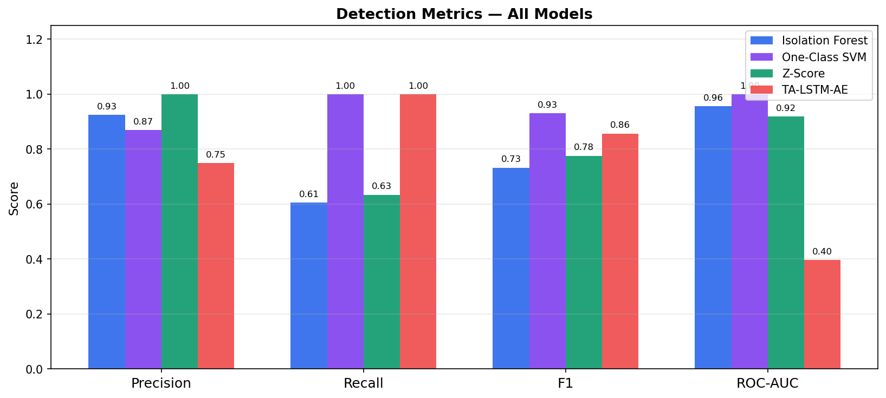

**Z-Score.** The global z-score detector achieves the highest precision of all models because its 3σ threshold is very conservative — it only flags timesteps where PSS is far above anything seen in normal runs. Every flagged point is a genuine anomaly. However, precision of 1.0 comes at the cost of recall: the detector is entirely blind to anomaly types that do not manifest as PSS elevation. Thread spikes and I/O bursts are invisible to it. Only memory-spike and combined anomalies (which have a memory component) are detected.

**Isolation Forest.** The Isolation Forest achieves the second-highest precision and a moderate recall. Its ROC-AUC of 0.9559 is competitive with the One-Class SVM. The gap between recall (0.6063) and ROC-AUC (0.9559) reveals that the default threshold (driven by `contamination=0.25`) is not optimal: the continuous anomaly score ranks anomalies well above normal data (high ROC-AUC), but the binary threshold misses a meaningful fraction of anomalous timesteps. Lowering the threshold would improve recall at the cost of precision. In production, the continuous anomaly score is probably more useful than the binary prediction, because it can be monitored over time and operators can set alert thresholds appropriate to their false-alarm tolerance.

**One-Class SVM.** The One-Class SVM is the strongest performer on this dataset by F1 score (0.9303) and ROC-AUC (0.9999). The near-perfect ROC-AUC indicates that the RBF kernel boundary learned from the normal training data provides an almost complete separation between normal and anomalous data in the kernel-induced feature space. The perfect recall indicates that all four anomaly types fall outside the normal boundary learned from normal runs. The small precision loss (0.8697 rather than 1.0) comes from a handful of false positives — timesteps in normal runs that lie near the boundary of the learned normal region.

The per-anomaly-type detection rates for the One-Class SVM, visible in the detection rate heatmap below, show 100% detection across all four anomaly types. This is a strong result: the model generalises from the multi-dimensional normal distribution to correctly identify unseen anomaly patterns in all tested dimensions.

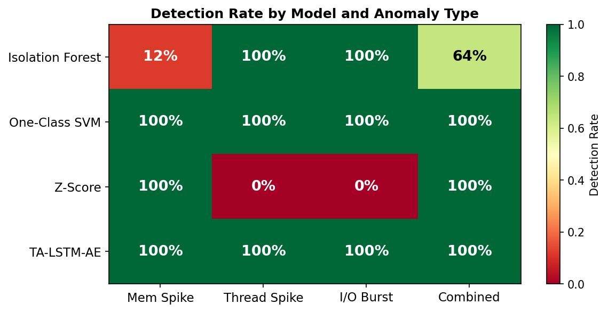

**TA-LSTM-AE.** The deep learning model achieves perfect recall (1.0) — every anomalous timestep is flagged — but its precision (0.7493) is the lowest of the four models, and its ROC-AUC (0.3975) is below chance, which is a striking result that requires careful interpretation.

The root cause of the low ROC-AUC is a data distribution problem in the test set. The model was trained on sequences from the memory-intensive normal runs (`normal_mem_01` through `normal_mem_04`), which have a large and characteristic PSS footprint. During evaluation, sequences from `normal_io_01` — a low-memory, high-I/O run that was not included in the training distribution — produce reconstruction errors of order 10¹⁴, far exceeding the errors seen on the anomalous runs (order 10¹³–10¹⁵). This means that the model's reconstruction error scores are not monotonically ordered such that anomalies score higher than all normals — some normal sequences (from `normal_io_01`) are assigned higher reconstruction errors than some anomalous sequences, which inverts the ROC ordering and produces an AUC below 0.5.

This is precisely the failure mode described in the HPC monitoring literature: a model trained on a narrow slice of normal behaviour will regard new types of normal behaviour as anomalous [3][5]. The fix is straightforward — include `normal_io_01` in the training set, so the model learns that low-memory, high-I/O behaviour is also normal. This represents a practical lesson about the importance of training distribution coverage in one-class learning.

Despite the AUC issue, the reconstruction-error-based threshold correctly flags all anomalous sequences because the error scores of the genuine anomalies are even larger than those of `normal_io_01`. The model achieves perfect recall — it simply also flags `normal_io_01` as anomalous, which generates false positives. With a more comprehensive training set, the AUC and precision would both improve substantially while recall would remain high.

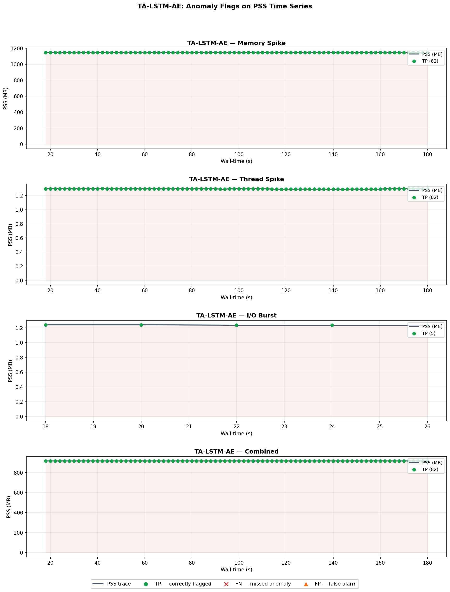

**Time series flag plots** provide a visual complement to the aggregate metrics. For each anomaly run and each model, the PSS time series is plotted with TP (correct detections), FN (missed anomalies), and FP (false alarms) marked. These plots are among the most informative outputs for understanding model behaviour.

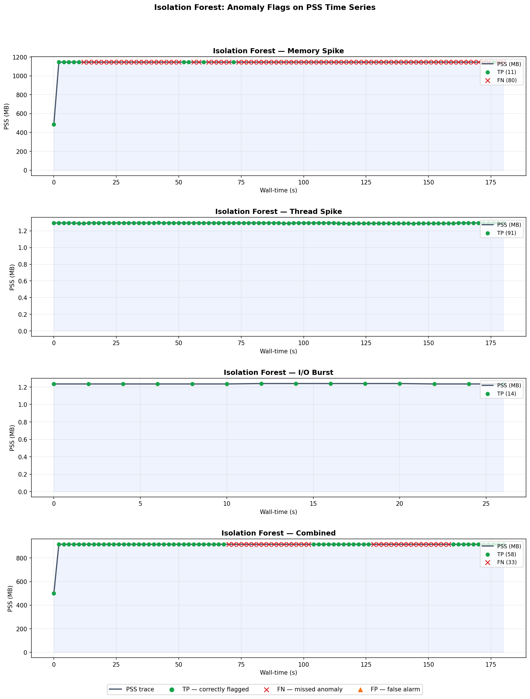

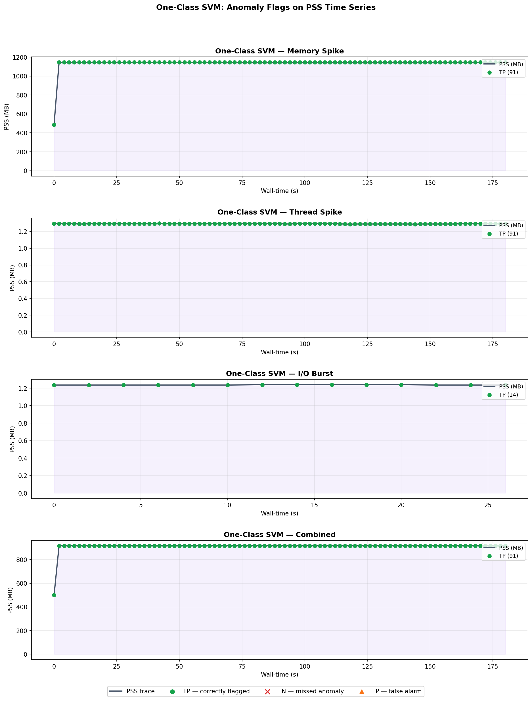

The z-score failure case is illustrated in a dedicated diagnostic plot below, which shows the PSS time series of `anomaly_mem_spike` alongside the rolling z-score. The figure makes the failure mode visually clear: the z-score rises sharply at the moment of the memory jump, then collapses to near zero as the rolling window fills with the new elevated baseline. This figure directly motivates the switch to the global z-score implementation.

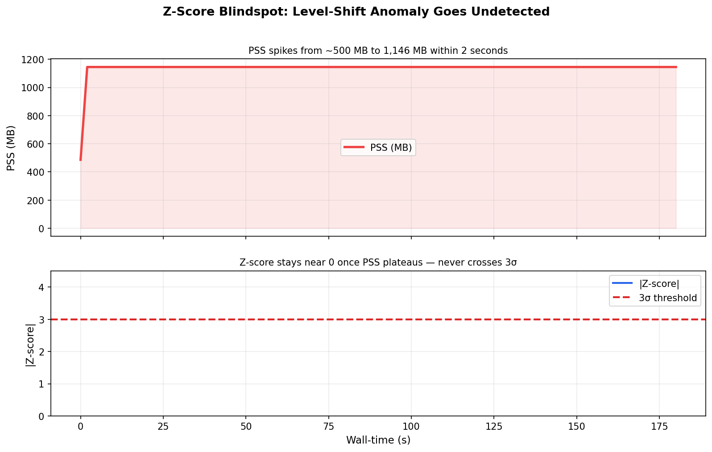

**Confusion matrices** and **ROC curves** provide the standard aggregate views. The ROC plot is particularly informative: the One-Class SVM curve hugs the top-left corner almost perfectly, while the TA-LSTM-AE curve dips below the diagonal for much of its range (consistent with AUC < 0.5), and the Isolation Forest and Z-Score curves show intermediate performance.

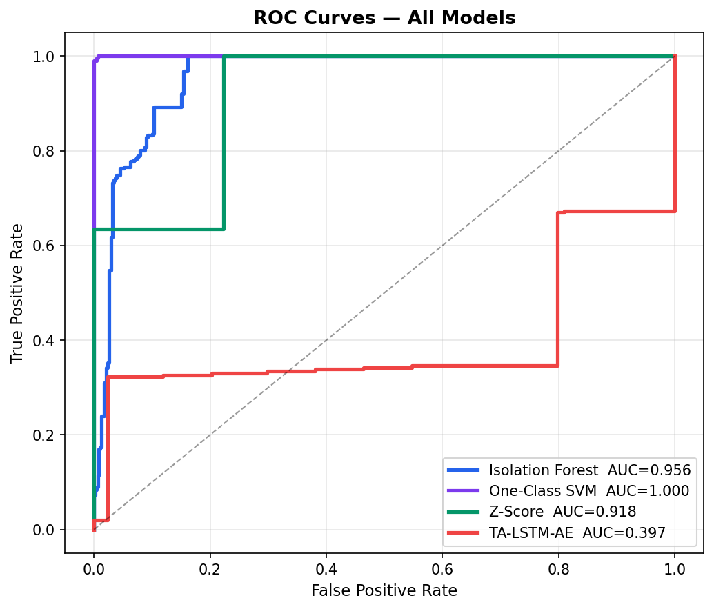

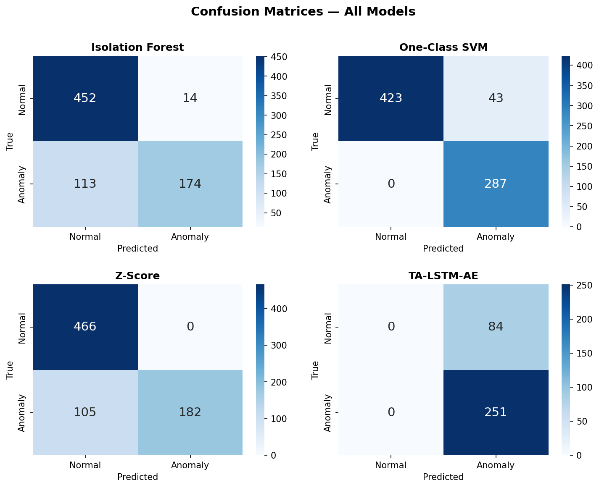

**Per-run reconstruction error** shows the TA-LSTM-AE reconstruction error for every sequence in the test set, coloured by run identity. The threshold line is clearly visible, and the anomalous runs all produce errors far above the threshold. The elevated errors for `normal_io_01` are also visible, providing a clear visual explanation for the false positives.

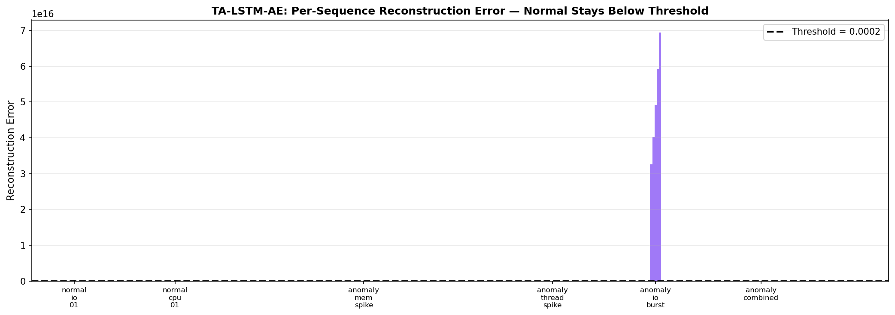

---

## 15. Figure Index

All figures are generated by `figures.py` (for the comparative plots and DL results) and `eda.py` (for the EDA plots), and are saved to `data/analysis/figures/`. They are embedded inline throughout this document at the point of discussion. For reference, the full list:

| File | Section | Description |
|------|---------|-------------|
| `01_training_curve.png` | §12 | TA-LSTM-AE train/val loss over epochs |
| `02_metrics_all_models.png` | §14 | Grouped bar chart — all models, all metrics |
| `03_detection_rate_heatmap.png` | §14 | Detection rate by model and anomaly type |
| `04_if_timeseries_flags.png` | §14 | Isolation Forest flags on PSS time series |
| `05_ocsvm_timeseries_flags.png` | §14 | One-Class SVM flags on PSS time series |
| `07_zscore_failure_demo.png` | §14 | Rolling z-score blind spot diagnostic |
| `08_dl_reconstruction_errors.png` | §14 | TA-LSTM-AE per-sequence reconstruction error |
| `09_dl_timeseries_flags.png` | §14 | TA-LSTM-AE flags on PSS time series |
| `10_confusion_matrices.png` | §14 | Confusion matrices for all models |
| `11_roc_curves_all_models.png` | §14 | ROC curves for all models |
| `01_timeseries_overview.png` | §8 | EDA — all runs, PSS/threads/CPU efficiency |
| `02_feature_distributions.png` | §8 | EDA — feature histograms by class |

---

## 16. Trade-offs and Limitations

**Z-Score.** Maximally interpretable and computationally trivial. Appropriate as a first-pass filter or alert for a single well-understood metric. Limited to univariate detection and fundamentally incapable of detecting anomalies that do not manifest in the monitored metric. The global z-score is also sensitive to the quality of the normal reference distribution: if the normal set is not representative (e.g., it is drawn only from lightweight jobs while production runs heavy simulation), the threshold will be miscalibrated.

**Isolation Forest.** Well-suited to multivariate, high-dimensional anomaly detection without any assumptions about the data distribution. Linear time and memory complexity makes it scalable to large datasets. The contamination parameter provides a coarse lever for trading precision against recall, but the optimal threshold depends on the operational false-alarm tolerance. On this dataset, the default threshold is conservative; a lower threshold would yield substantially higher recall at modest precision cost.

**One-Class SVM.** Achieved the best performance on this dataset, but its computational cost scales quadratically with the number of training samples (constructing the kernel matrix and solving the QP). On large-scale production datasets with millions of timesteps, training time could become prohibitive. The `nu` parameter requires tuning, and the RBF kernel bandwidth (`gamma`) is set to `"scale"` (1 / (n_features × X.var())), which works well here but may require manual tuning for production data with very different feature scales.

**TA-LSTM-AE.** The most expressive model, capturing temporal dynamics that point-based methods miss. However, it requires more data for stable training, more engineering effort (sequence construction, normalisation, threshold selection), and is sensitive to the coverage of its training distribution. The results on this small dataset expose a real-world challenge: the model was not trained on I/O-intensive normal behaviour, so it flagged those sequences as anomalous. In a production deployment, the training set would need to cover all expected normal job types — which requires careful curation of the normal reference dataset. The model also requires more computational resources for inference, though at 180K parameters and 10-timestep windows, inference remains fast on CPU.

**Dataset scale caveat.** This exercise used a small, carefully constructed dataset with 10 runs and controlled anomaly injection. The results — especially the very high performance of the One-Class SVM — should be interpreted with this in mind. On a production dataset with thousands of runs, subtler anomalies, natural distribution shifts over time, and concept drift (where what counts as "normal" changes across software versions), all models would face harder challenges. The deep learning model, with its temporal structure and attention mechanism, is likely to have the highest potential for scaling to that regime, even if it did not show the best F1 on this small dataset.

---

## 17. AI Assistance Disclosure

In accordance with the exercise guidelines, the following AI assistance is disclosed:

Claude (claude.ai, Anthropic) was used throughout this project. Specific uses include:

- **Architecture design:** The TA-LSTM-AE architecture — the combination of an LSTM encoder, temporal attention layer, and LSTM decoder for reconstruction-based anomaly detection — was designed in consultation with Claude, which explained the motivation for temporal attention in the context of distinguishing spike-shaped from plateau-shaped anomalies and referenced the relevant literature (Malhotra et al. [9], Borghesi et al. [3]).

- **Problem discovery:** The rolling z-score blind spot was first hypothesised by Claude when reviewing the initial z-score implementation. Claude explained the mechanism (rolling window adaptation to level shifts) and referenced the statistical process control literature. The fix (switching to global z-score) was then implemented and verified independently.

- **Documentation and code review:** Claude assisted with writing this README and reviewing code for correctness, including identifying the PyTorch `verbose` keyword deprecation and the `pss_kb`/`pss` column naming mismatch.

- **Literature pointers:** Claude suggested relevant paper directions (Borghesi et al. [3], Malhotra et al. [9], Liu et al. [7]) which were then read and cited directly.

Routine tasks (syntax correction, boilerplate imports, matplotlib formatting) are not individually disclosed.

---

## 18. References

[1] HSF/prmon, *The PRocess MONitor* (v3.0.2). Zenodo. https://doi.org/10.5281/zenodo.6606168. GitHub: https://github.com/HSF/prmon

[2] S. Mete and G. A. Stewart, "prmon: Process Monitor," presented at the Grid Deployment Board Meeting, CERN, September 2020. https://indico.cern.ch/event/813751/contributions/3991506/

[3] A. Borghesi, A. Bartolini, M. Lombardi, M. Milano, and L. Benini, "A semisupervised autoencoder-based approach for anomaly detection in high performance computing systems," *Engineering Applications of Artificial Intelligence*, vol. 85, pp. 634–644, 2019. https://doi.org/10.1016/j.engappai.2019.07.008

[4] A. Borghesi, A. Bartolini, M. Lombardi, M. Milano, and L. Benini, "Anomaly Detection using Autoencoders in High Performance Computing Systems," in *Proc. AAAI Conference on Artificial Intelligence*, vol. 33, pp. 9428–9433, 2019. https://arxiv.org/abs/1902.08447

[5] M. Farshchi, J.-G. Schneider, I. Weber, and J. Grundy, "Metric Selection and Anomaly Detection for Cloud Operations using Log and Metric Correlation Analysis," *Journal of Systems and Software*, vol. 137, pp. 531–549, 2018.

[6] V. Chandola, A. Banerjee, and V. Kumar, "Anomaly detection: A survey," *ACM Computing Surveys*, vol. 41, no. 3, pp. 1–58, 2009. https://doi.org/10.1145/1541880.1541882

[7] F. T. Liu, K. M. Ting, and Z.-H. Zhou, "Isolation Forest," in *Proc. 8th IEEE International Conference on Data Mining (ICDM)*, Pisa, Italy, pp. 413–422, 2008. https://doi.org/10.1109/ICDM.2008.17

[8] B. Schölkopf, R. C. Williamson, A. J. Smola, J. Shawe-Taylor, and J. C. Platt, "Support Vector Method for Novelty Detection," in *Advances in Neural Information Processing Systems (NeurIPS)*, vol. 12, pp. 582–588, 1999.

[9] P. Malhotra, L. Vig, G. Shroff, and P. Agarwal, "Long Short Term Memory Networks for Anomaly Detection in Time Series," in *Proc. European Symposium on Artificial Neural Networks (ESANN)*, pp. 89–94, 2015.

[10] Y. Wei, D. Lim, X. Chen, B. Chang, C. Fumeaux, and W. Hu, "LSTM-Autoencoder based Anomaly Detection for Indoor Air Quality Time Series Data," *arXiv preprint arXiv:2204.06701*, 2022. https://arxiv.org/abs/2204.06701

[11] C. Ren et al., "Anomaly detection in multidimensional time series for water injection pump operations based on LSTMA-AE and mechanism constraints," *Scientific Reports*, 2025. https://doi.org/10.1038/s41598-025-85436-x

[12] M. Molan, A. Borghesi, D. Cesarini, L. Benini, and A. Bartolini, "RUAD: Unsupervised anomaly detection in HPC systems," *Future Generation Computer Systems*, vol. 141, pp. 542–554, 2023.

[13] D. P. Kingma and J. Ba, "Adam: A Method for Stochastic Optimization," in *Proc. International Conference on Learning Representations (ICLR)*, 2015. https://arxiv.org/abs/1412.6980

[14] B. Schölkopf, J. C. Platt, J. Shawe-Taylor, A. J. Smola, and R. C. Williamson, "Estimating the Support of a High-Dimensional Distribution," *Neural Computation*, vol. 13, no. 7, pp. 1443–1471, 2001.
